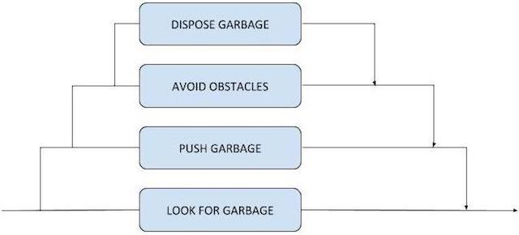
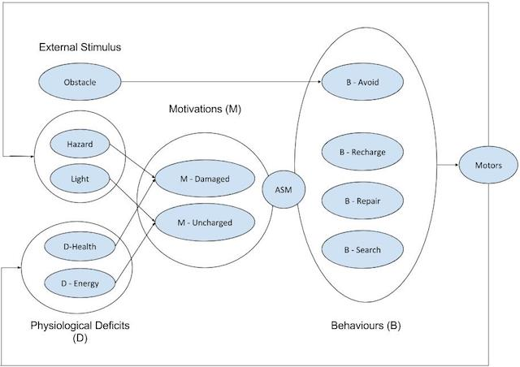
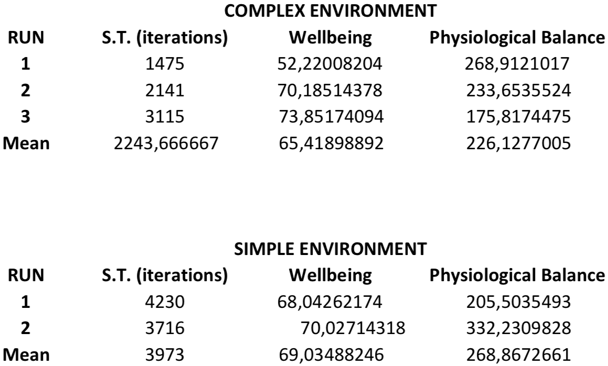

# CONSTRUCTING AUTONOMOUS SYSTEMS
######
 Constructive Artificial Intelligence, 2017-2018 
 

  

## INTRODUCTION

In this paper, we are going to describe the implementation and testing of three different autonomous systems. These were constructed using an e-puck robot and a controller for that robot, written in the C programming language. We will take advantage of the sensors of the robot, more specifically the light sensors, ground sensors and proximity sensors, to transform these simple robots into more complex autonomous systems. 

First, we are going to explain the implementation and control architecture used. After that, we are going to describe the testing environments and the results obtained.

The autonomous systems will have the following purposes:

* A wall-following robot.
* A garbage-collector robot.
* A robot with a motivated architecture that uses a simulated physiology of homeostatically controlled variables, as well as appropriate motivations and behaviours to solve a two-resource problem. This will be described in more detail in the corresponding section.

---

## WALL-FOLLOWING ROBOT

#### IMPLEMENTATION

The first robot is programmed to find a wall and follow it indefinitely. For that, a subsumption architecture is used, being the levels, from the most basic to the fundamental one:

1. Move in a straight line.
2. Find a wall to follow if it is not following one already.
3. Avoid every obstacle in the way, trying not to loose the wall in the process.
4. Avoid getting stuck on corners.

Subsumption architectures are a type of reactive control architectures used in embodied AI that decomposes the complete behaviour of the robot in a series of sub-behaviours. These sub-behaviours are organised in what are called levels of subsumption, in a way that each level implements a particular behaviour that subsumes its lower levels. Higher levels have a higher priority. 

In the current case, the robot would just move in a straight line on ideal conditions. The level above will make sure that the robot is following a wall, overriding the "go straight" behaviour if it is not. But whether is following a wall or not, it must avoid every obstacle in its way, which the third level ensures. Lastly, a fourth and more important level was added to make sure the robot does not get stuck in corners. Those behaviours with that organisation make a robot that follows a wall.

All of this is implemented with a simple if-else sequence in the main loop of the controller. First of all, we check if the robot was turning in the previous iteration because of a corner, which is known because of a variable that acts as a small memory. In that case, decreases that variable and calls the `escape_from_corner()` method. This section was not established as a subsumption level because it just complements an unfinished previous behaviour. 

This `escape_from_corner()` function is also called in the top subsumption level; it makes the robot turn to the side whose proximity sensors detected the smaller value. The next `else if` statement checks if there are any obstacle in the robot's way. For when that is the case, we recycled the `avoid_motor_values()` method provided in practical session 7. 

The last `else if` checks that the robot has a wall on one of its sides, measuring the values detected by its proximity sensors 2 and 5 (the ones from the sides). If the answer to that is no, the method `look_for_a_wall()` makes the robot move in the direction of the proximity sensor that is detecting a higher value. 

For the rest of the cases, the controller makes the robot move in a straight line setting the `left` and `right` variables to the same speed. 

The reason to use this scheme in particular is because, in the robot's environment, those are all the situations the robot could run into. Being by the wall, the only thing the robot must do is go straight, but it also must avoid every obstacle that might be found, like rocks or other robots. If it is not by the wall, it will have to look for one, still being important to avoid obstacles. Once testing the results, we found that the robot used to get stuck in corners several times, so another level was added to prevent this from happening. 

It is clear that the "go straight" behaviour is the simplest one and has to be in the bottom level. The "look for a wall" behaviour cannot be on top of any other, because the robot cannot look for a wall if there is an obstacle or if it is stuck in a corner. Lastly, a corner could be mistaken by a simple obstacle if the "avoid obstacles" behaviour was on top, so it was set as level 3 and "avoid getting stuck in corners" as level 4. 

#### TESTING

For the testing phase, two different environments were used:

* A simple environment with just one robot and a wall. The rest is empty. The goal is to check if the robot follows the wall correctly.
* A complex environment with two robots, the wall, and two obstacles by the wall, one of them in a corner. 
	* Placing more than two robots might be pointless: the goal is to see how a robot would behave when it runs into another robot. 
	* Placing obstacles in the middle of the arena to see how the robot reacts to them is not of the interest of this test. Besides, for avoiding obstacles we are re-using a code that we already know that works perfectly. However, it is interesting to check how a robot that is following a wall reacts to an obstacle that does not allow it to follow its current path. 

The simple environment will be tested twice, and the complex one three times. All "runs" will have a duration of 4 minutes and 30 seconds, with one robot starting at *(0, 0, 0)*, facing the direction of the *x-axis*; and the other (for the complex environment) starting at *(0.1, 0, 0.1)*, with a deviation of 0.7854 radians from the *x-axis*. This situation sets both robots almost looking at each other from the beginning. Notice that the preset Webots `OilBarrel` object has been used for representing the obstacles. 

For the simple test, both runs have been, as expected, extremely similar. The only real difference between the two was that the robot found the wall facing more right in one, and more left in the other, so the two runs were enough to test that the robot follows the wall correctly in both directions. But for both simulations, once found the wall, the robot remained by it, not loosing track of it and moving at the usual speed. A little hesitation was noticed sometimes when the robot reached a corner, but nothing more than one second before continuing successfully. 

The complex test also showed very good results, except for one concrete aspect: the contact of both robots when at least one of them is following the wall. At the start of each simulation, the robots ran into each other, avoiding contact successfully, but in some cases they end up having contact because they are following the wall in opposite directions, or because one of them reaches the other one from behind. In this cases, the programmed architecture makes the robot interpret that the other robot is a wall or a static obstacle, which makes each robot want to surround each other hoping to find the wall again after that. That does not work and both robots loose contact with the wall and stay in contact for a couple of seconds, before being free to look for the wall again.

For the rest, the simulation was able to run smoothly. When the robots do not run into each other, they are able to follow the wall by themselves and surround every obstacle. The controller makes a robot interpret that these objects are part of the wall, because they form a corner with the wall. So the robot escapes from that corner and follows the border of the obstacle, eventually finding the other corner and continuing from the other side of the obstacle. In the three simulations, only three times a robot lost track of the wall when encountering an obstacle, all of them in the second simulation.

This process is not 100% fluid though. The little hesitation with the corners of the wall becomes a little more noticeable with the corners formed by the wall and an obstacle, although the robot ends up describing the right trajectory. Also, the speed when surrounding the object is considerably slower. 

The e-puck robot's proximity sensors are very limited. According to the documentation, they are useful for detecting objects at a distance of just 4cm or less. This is a serious bottleneck in some cases, because it removes the possibility of detecting objects with time so a plan for avoidance can be processed. This could, for example, simplify the interaction between two robots. However, the main goal of the robot is achieved successfully: follow the wall, even with obstacles. 

## GARBAGE-COLLECTION ROBOT

#### IMPLEMENTATION

The next robot is programmed to clean the arena of garbage. It searches for "garbage items" in the arena (represented with cans), and pushes it by the wall. The robot continues the process until all garbage has been cleaned. 

To program this behavior, we have started from the controller of the previous robot, modifying the subsumption architecture to fit the new needs. In the end, the subsumption levels were the following:

1. Dispose the garbage, turning around when it is by the wall.
2. Avoid every obstacle.
3. Push the garbage in a straight line, looking for the wall.
4. Look for garbage to be cleaned.

We already explained how subsumption architectures work in the previous robot overview. The most basic level guides the robot in the search for garbage to clean. In case the robot has already found garbage to clean, the upper level subsumes this behaviour, making the robot push the garbage. In this process, we must make sure that the robot does not get stuck with obstacles, so the third level takes control when an obstacle is detected, so the robot can avoid it. The top level just makes the robot turn around when the garbage has already been disposed in the disposal area. 

In this case, the fact that we started from the controller of the previous robot makes the code structure not that evident. The `if-else` statements no longer represent the subsumption architecture. This is also because of the limitations of the robot itself and its sensors. Obstacle detection is carried out using the proximity sensors, but *Webots* documentation estates that the e-puck's proximity sensors are reliable when obstacles are at least 4cm close. This is a huge bottleneck for a few reasons:

* There is no way to detect when the robot is pushing garbage that is already by the wall. Proximity sensors 0 and 7 are useful to know that the garbage is in front of the robot, but sensors 1 and 6 are not capable of detecting the wall behind. This is because the diameter of the cans that represent the garbage is bigger than 4cm.
* This problem extends to the obstacles in the middle of the arena. The robot might push a can against an obstacle and there would not be a way to notice that situation. 

These problems had to be solved, instead of modifying the controller code, modifying the robot's environment, so different sensors could be used. We decided to mark the disposal area and obstacles areas with black color in the ground, the rest being white. This would allow to use the ground sensors to detect obstacles and the disposal area, and the proximity sensors to find and push garbage. 

The code, like with the previous robot, has a main sequence of `if-else` statements that "decides" which behavior should be executed. As said before, in this case this statements do not directly represent the subsumption architecture.

* The first statement is not a part of the architecture, but a way to continue the execution of previous behaviors. When turning around, we used the static variables `turning_around_left` and `turning_around_right` as counters, so the robot could keep on turning the next few iterations of the main loop.
* The next statement checks if the robot has touched a wall, what could be the real wall or an obstacles. Takes a look at the values of the ground sensors and, in case these detect a black area, then the robot starts turning away.
* The next statement runs if the robot is pushing garbage. Uses the proximity sensors 0 and 7 to push it in a straight line, working in a similar way to the robot that followed the black line: moving slightly right or slightly left depending on which of them detects the higher value. 
* The last statement runs only if all the rest did not, which means that there are no obstacles or walls, and the robot is not turning or pushing garbage. In that case, the method `look_for_garbage()` is called. It makes the robot move in a straight line, deviating only if a proximity sensor measures a value bigger than a threshold (80). This does not work perfectly due to the previously mentioned limitations of the proximity sensors, but it has helped find cans faster in some cases. 

As we can see, the "AVOID OBSTACLES" level and the "DISPOSE GARBAGE" level are united in a single statement. It works because the environment demands little differentiation between the disposal area and the obstacles. Both situations, being in the disposal area or in front of an obstacle, require the robot to turn around. That could mean leaving a can in the disposal area, which is considered a success, or in front of an obstacle. The latter could seem like a big problem, but in the testing phase we will see that does not stop the robot from cleaning that can in the end. 

#### TESTING

Again, we are going to test this robot using two different environments. In all of them, OilBarrel objects are going to be placed as obstacles, and the Can objects as garbage. We expect the robot (or robots) to clean the garbage by pushing it to the wall.

* A simple environment, with just garbage and no obstacles. The reason to use this environment is to make sure that the robot is capable of cleaning the arena at a basic level. 
* A complex environment, with some three obstacles and three robots, in addition to the cans. Here, we are going to test how capable the robot is to clean the garbage in a more "accidental" environment resolving crashes against obstacles and other robots.

Other aspects of the simulations are similar to the ones with the previous robot. There will be three "runs" with the complex environment, and two with the simple one, with a duration of 4 minutes and 30 seconds for all of them. The three robots of the complex environment will start from different points, widely separated and moving in different directions. 

Testing with the simple environment, we can observe decent results. In one of the runs, the robot was capable of cleaning all garbage before the time was up. In the other run, there were still three cans to go. 

The inability to guarantee the cleanliness of all garbage does not have anything to do with any problem in the robot's basic behaviours. Once the robots finds a can, it pushes it perfectly and leaves it by the wall, turning away to continue with its duties. Considering that we are using the ground sensors to detect the disposal area, this effectiveness was expected.

However, the robot is not always capable of cleaning all garbage due to the previously mentioned limitations of the proximity sensors. Detecting the cans from a distance is extremely difficult with this e-puck, so the robot needs some luck to pass near one of them. When this happens, the robot is very efficient, but when it does not, it can take some time. 

In the complex environment we noticed some other problems, although in the end the robots have more possibilities of cleaning all the garbage, obviously due to a matter of numbers (three robots clean better than one). We say this because, in the three runs, the robots cleaned all the garbage twice, leaving just one can in the third run. This is positive, but there were other problems worth pointing out. 

First, the limitations when trying to detect obstacles make the robot realize it has to dodge just when the obstacle is in front of it. This, when a can is being pushed, makes the robot leave the can and turn around. Although this behavior is not the ideal, it is compensated because, some time later, another robot comes from a different angle and finds the can. This makes the robot not run into the obstacle, passing him by the side and moving the can successfully. 

The other problem, and probably the biggest one, has to do with the fact that the robots consider each other as garbage. In a similar way to what happened with the first robot, that considered any other robots as obstacles that had to be surrounded, in this case they try to push each other. Having both of them the same "strength", this caused them not to move at all, getting stuck in the same point. Thankfully, this problem was not catastrophic because the robots always ran into each other when moving in different directions, so after two or three seconds, they ended up separating. 

With three robots though, as it happened in the last run, the situation gets worst. Two robots started pushing in approximately the same direction, which made the remaining robot move backwards. In the specific case of the third run, it took them long enough to separate that the robot that was being pushed ended up in the disposal area, far enough from the white floor that the robot was incapable to leave, spinning round itself because it was detecting the black floor in all iterations. This situation was probably the reason why the time was up before all cans where moved to the wall. 

In the end, the limitations of the proximity sensors and the difficulty when trying to differentiate other robots from cans conditioned the final results. However, the wanted behaviours were executed successfully in good enough conditions, which would have been much more difficult without using the ground sensors and a "marked" arena. 

---

## TWO-RESOURCE ROBOT

#### IMPLEMENTATION

The third and last robot will be a motivated autonomous system that can solve a "two-resource" problem. This robot has a simulated physiology with two homeostatically controlled variables: energy and damage. 

* Energy (or battery) simply decays with time and speed, and when it reaches value zero, the robot dies. For recharging, the robot needs to situate under a light.
* Damage is a result of being too close to obstacles. In our environment, obstacles (and the wall) emit hazardous particles that damage the robot, so the robot should remain as far as possible from these obstacles. When reached 100 damage, the robot is destroyed. For repairing, the robot must situate on a black area of the arena.

This type of motivated architecture has a series of processes that try to maintain the physiological values within a certain range. When the value of this variable (or variables in this case) gets close to a fatal limit, a certain behaviour is triggered (activating function) in order to return that variable to an acceptable value. An organising function combines the individual behavioural components into one coherent behaviour. This is especially important when managing more than one variable, because each variable generally triggers one specific behaviour for adjusting its value.

In the case of our controller, all the decisions made for moving the robot are based on the values that we find in the two fundamental variables. A specific function, `determine_behaviour()`, checks their value and decides which behaviour is going to be executed in each iteration. 

* When there is no need for reparation or recharging, the robot just wanders around. For that, we recycled the `object_avoidance_motor_values()` function described in practical session 7. 
* When there is need for reparation (> 60), the robot is going to look for a black area on the ground, for which we recycled the `line_follow_motor_values()` method from practical 7. An exception to this happens if the energy level decays to a critical state. If the robot runs out of battery, it is going to die either way, but damage can be avoided while trying to recharge.
* When there is need for recharging, the robot is going to follow the light and place under it. 

Obviously, the described behaviour needs of three different sensors of the e-puck. The proximity sensors are responsible for avoiding obstacles and the wall, the light sensors are responsible for detecting the light that lead to the recharging area, and the ground sensors are used for detecting the black boxes on the ground that represent the reparation areas.

For convenience, when the robot finds the recharging area while trying to reach a different goal, we try to take advantage of that by making it stop and recharge. If the robot was just wandering, then there is no urgency and can stop there. If, on the other hand, the robot was looking for a reparation area, remaining stopped in the charging area would not risk receiving more damage (except if another robot impacted with it).

The same thing happens with the reparation areas. When the robot unintentionally finds one, it will stop there for reparations even if it is trying to reach the light for recharging, because no speed means that no energy is lost. 

 

#### TESTING

##### QUALITATIVE TESTING

The tests for this controller are going to be performed, like in the two previous robots, in two different environments and several executions (runs) for each of them.

* The simple environment will have just one robot starting at *(0, 0, 0)* and heading in the direction of the *x-axis*. The number of hazardous obstacles, represented with `OilBarril` objects, is 9, distributed around the starting point of the robot. There will be three corners with reparation areas (black boxes on the ground) and the last corner will have a `PointLight` for recharging the robot. The goal of this test is simply to check the survival capacity of one robot. 
* The complex environment will be exactly like the simple one, but adding two more robots to the equation. One of them will start from *(0.6, 0, -0.3)* and the other from *(0.1, 0, 0.4)*, heading different angles. The goal when running this complex test is to examine the survival capacity of the robots when having to share key areas of the arena. Obviously, the robots will inflict damage to each other when they get too close. 

All runs had a duration of 4 minutes and 30 seconds, as with the previous robots, and the simple environment was used in two runs and the complex one in three runs.

The simple tests showed a more than decent survival capacity for the robot. In an exclusive environment with no other robots, the difficulties for recharging and repairing were almost inexistent. The light is easily detectable and the robot has plenty of time for crossing the entire arena, once the energy alert triggers, before running out of energy. 

When it comes to avoiding damage, most of the interactions are safely detected with time so the robot can change its direction. This was expected, since the method for avoiding obstacles has been used successfully before. However, sometimes the robot gets too close and receives damage, for example when two obstacles are too close and the robot finds itself between them. 

The worst case happens when the robot runs into a corner. That takes it a few iterations to turn enough to escape, so if it got too close in the first place, it will receive a lot of damage and, most certainly, end up being destroyed. This is precisely what occurred in the second run. 

In the first run, however, the robot survived until time finished. This case, in conjunction with many other "unofficial" runs performed during development in which the robot stayed alive all the time, prove that the order of priorities when deciding which behaviour to execute was adequate. 

When it comes to the tests with the complex environment, the results are considerably different. Every robot, on its own, maintains the same level of effectiveness when it comes to surviving that we saw in the simple environment. However, they are sharing the reparation areas and, more importantly, the recharging area. This makes a real difference, because they end up destroying each other until just one of them survives.

The reason why this is happening is pretty simple. Although every robot starts from a different point of the arena, moving in a different direction, and their speeds vary depending on the obstacles they find, they would most likely run into each other when they try to charge. When a robot arrives at the charging area, it has to wait until the energy gets to 100. In that time, another robot would probably arrive and make contact with it. And after that, it happens again with the last robot. This situations always result in at least two robots receiving considerable damage.

In the second run, the three robots were dead at 3 minutes and 10 seconds. All of them happened to need energy almost at the same time, so they inflicted serious damage to each other, destroying one of them. After that, the next time that one robot needed energy, it found a dead robot right by the charging area, close enough to inflict damage so we had a second dead robot. And then, with two robots obstructing the recharging area, the last robot died before being able to escape. In the third run, this happened again with just two robots.

##### QUANTITATIVE TESTING

The following tables show the evolution of the wellbeing of the robot in all the runs performed, both in the simple environment (1 and 2) and in the complex environment (1, 2 and 3).

|  |  | 
| --- | --- |

|  |  |  |
| --- | --- | --- |

This data reflects what we were able to observe during the testing. The simple environment is much more friendly with the robot, allowing it to maintain a decent level of wellbeing. As we can see in the two first charts, the value goes up and down with time: when it goes down, the robot recovers, before it goes done again and so on.

In the *Wellbeing Simple 1* table, we can see that the simulation finished while the robot was recovering. In *Wellbeing Simple 2*, however, the value is descending by the end of the simulation. This is due to the fact that the robot, as we said in the previous section, died when it got to a corner. 

In the charts for the complex tests, it becomes clear that a robot has much more trouble maintaining its level of wellbeing when it has to deal with other robots in the same environment. Only in the third simulation, the graph is much more similar to the ones from the simple tests: it is able to recover every time the wellbeing decays under 50 or so. 

In the other two runs, we see that the wellbeing decays overtime and the robot is never able to recover, except in the second run, where its wellbeing value increases considerably around the middle of its lifetime. This results are due to a significant increase in the `damage` variable overtime: dealing with other robots implies contact most of the time. The energy levels, on the other hand, are very similar to those in the simple environment. 

Now, we are going to have a look at a more general assessment on the results obtained during the testing phase:

These calculations show again the considerably better results obtained with the controller when not having to deal with other robots. To begin with, the Survival Time (S.T.) is about a 50% higher in the simple environment. 

The wellbeing, however, does not seem that much better in the simple environment in the end. In fact, if it was not for the first run, the complex environment would have a better average value. This numbers are very surprising, knowing everything we had observed so far.

Lastly, we have the physiological balance, which is slightly better in the complex environment. This, although it might seem surprising, is very normal. In a run on a simple environment, the need of reparation is very unusual when comparing with a run in the complex environment. The needs of the robot are usually focused on recharging its battery, being the needs of reparation much more uncommon; the fact that some needs are significantly higher than others is reflected in a higher value for the physiological balance.

On a complex environment, on the other hand, running into other robots inflicts damage, which makes the needs of reparation much more frequent. Then, the fact that the physiological balance is better on the complex environment, does not mean that the robot "suffers" less under those circumstances. 

---

## CONCLUSIONS

In the end, we have been able to implement decent behaviors for all the robots. On ideal conditions, reflected on the simple environments where we tested them, we did not find any clear problems. The basic behaviors worked perfectly.

The problems came, mostly, when the robots ran into other robots. The limitations of their sensors makes it difficult make a differentiation between robots and other elements of the arena. Thankfully, this problems did not totally ruined the obtained results.  

