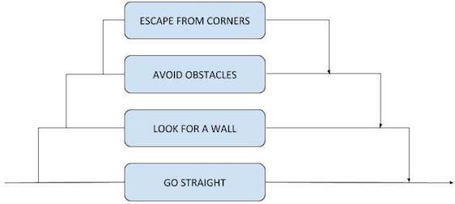

# CONSTRUCTING AUTONOMOUS SYSTEMS
######
 Constructive Artificial Intelligence, 2017-2018 
 

  

## INTRODUCTION

In this paper, we are going to describe the implementation and testing of three different autonomous systems. These were constructed using an e-puck robot and a controller for that robot, written in the C programming language. We will take advantage of the sensors of the robot, more specifically the light sensors, ground sensors and proximity sensors, to transform these simple robots into more complex autonomous systems. 

First, we are going to explain the implementation and control architecture used. After that, we are going to describe the testing environments and the results obtained.

The autonomous systems will have the following purposes:

* A wall-following robot.
* A garbage-collector robot.
* A robot with a motivated architecture that uses a simulated physiology of homeostatically controlled variables, as well as appropriate motivations and behaviours to solve a two-resource problem. This will be described in more detail in its corresponding section.

## WALL-FOLLOWING ROBOT

#### IMPLEMENTATION

The first robot is programmed to find a wall and follow it indefinitely. For that, a subsumption architecture is used, being the levels, from the most basic to the fundamental one:

1. Move in a straight line.
2. Find a wall to follow if it is not following one already.
3. Avoid every obstacle in the way, trying not to loose the wall in the process.
4. Avoid getting stuck on corners.

Subsumption architectures are a type of reactive control architectures used in embodied AI that decomposes the complete behaviour of the robot in a series of sub-behaviours. These sub-behaviours are organised in what are called levels of subsumption, in a way that each level implements a particular behaviour that subsumes its lower levels. Higher levels have a higher priority. 

In the current case, the robot would just move in a straight line on ideal conditions. The level above will make sure that the robot is following a wall, overriding the "go straight" behaviour if it is not. But whether is following a wall or not, it must avoid every obstacle in its way, which the third level ensures. Lastly, a fourth and more important level was added to make sure the robot does not get stuck in corners. Those behaviours with that organisation make a robot that follows a wall.

All of this is implemented with a simple if-else sequence in the main loop of the controller. First of all, we check if the robot was turning in the previous iteration because of a corner, which is known because of a variable that acts as a small memory. In that case, decreases that variable and calls the `escape_from_corner()` method. This section was not established as a subsumption level because it just complements an unfinished previous behaviour. 

This `escape_from_corner()` function is also called in the top subsumption level; it makes the robot turn to the side whose proximity sensors detected the smaller value. The next `else if` statement checks if there are any obstacle in the robot's way. For when that is the case, we recycled the `avoid_motor_values()` method provided in practical session 7. 

The last `else if` checks that the robot has a wall on one of its sides, measuring the values detected by its proximity sensors 2 and 5 (the ones from the sides). If the answer to that is no, the method `look_for_a_wall()` makes the robot move in the direction of the proximity sensor that is detecting a higher value. 

For the rest of the cases, the controller makes the robot move in a straight line setting the `left` and `right` variables to the same speed. 

The reason to use this scheme in particular is because, in the robot's environment, those are all the situations the robot could run into. Being by the wall, the only thing the robot must do is go straight, but it also must avoid every obstacle that might be found, like rocks or other robots. If it is not by the wall, it will have to look for one, still being important to avoid obstacles. Once testing the results, we found that the robot used to get stuck in corners several times, so another level was added to prevent this from happening. 

It is clear that the go straight behaviour is the simplest one and has to be in the bottom level. The "look for a wall" behaviour cannot be on top of any other, because the robot cannot look for a wall if there is an obstacle or if it is stuck in a corner. Lastly, a corner could be mistaken by a simple obstacle if the "avoid obstacles" behaviour was on top, so it was set as level 3 and "avoid getting stuck in corners" as level 4. 

#### TESTING

For the testing phase, two different environments were used:

* A simple environment with just one robot and a wall. The rest is empty. The goal is to check if the robot follows the wall correctly.
* A complex environment with two robots, the wall, and two obstacles by the wall, one of them in a corner. 
	* Placing more than two robots might be pointless: the goal is to see how a robot would behave when it runs into another robot. 
	* Placing obstacles in the middle of the arena to see how the robot reacts to them is not of the interest of this test. Besides, for avoiding obstacles we are re-using a code that we already know that works perfectly. However, it is interesting to check how a robot that is following a wall reacts to an obstacle that does not allow it to follow its current path. 

The simple environment will be tested twice, and the complex one three times. All "runs" will have a duration of 4 minutes and 30 seconds, with one robot starting at *(0, 0, 0)*, facing the direction of the *x-axis*; and the other (for the complex environment) starting at *(0.1, 0, 0.1)*, with a deviation of 0.7854 radians from the *x-axis*. This situation sets both robots almost looking at each other from the beginning. Notice that the preset Webots `OilBarrel` object has been used for representing the obstacles. 

For the simple test, both runs have been, as expected, extremely similar. The only real difference between the two was that the robot found the wall facing more right in one, and more left in the other, so the two runs were enough to test that the robot follows the wall correctly in both directions. But for both simulations, once found the wall, the robot remained by it, not loosing track of it and moving at the usual speed. A little hesitation was noticed sometimes when the robot reached a corner, but nothing more than one second before continuing successfully. 

The complex test also showed very good results, except for one concrete aspect: the contact of both robots when at least one of them is following the wall. At the start of each simulation, the robots ran into each other, avoiding contact successfully, but in some cases they end up having contact because they are following the wall in opposite directions, or because one of them reaches the other one from behind. In this cases, the programmed architecture makes the robot interpret that the other robot is a wall or a static obstacle, which makes each robot want to surround each other hoping to find the wall again after that. That does not work and both robots loose contact with the wall and stay in contact for a couple of seconds, before being free to look for the wall again.

For the rest, the simulation was able to run smoothly. When the robots do not run into each other, they are able to follow the wall by themselves and surround every obstacle. The controller makes a robot interpret that these objects are part of the wall, because they form a corner with the wall. So the robot escapes from that corner and follows the border of the obstacle, eventually finding the other corner and continuing from the other side of the obstacle. In the three simulations, only three times a robot lost track of the wall when encountering an obstacle, all of them in the second simulation.

This process is not 100% fluid though. The little hesitation with the corners of the wall becomes a little more noticeable with the corners formed by the wall and an obstacle, although the robot ends up describing the right trajectory. Also, the speed when surrounding the object is considerably slower. 

The e-puck robot's proximity sensors are very limited. According to the documentation, they are useful for detecting objects at a distance of just 4cm or less. This is a serious bottleneck in some cases, because it removes the possibility of detecting objects with time so a plan for avoidance can be processed. This could, for example, simplify the interaction between two robots. However, the main goal of the robot is achieved successfully: follow the wall, even with obstacles. 

---