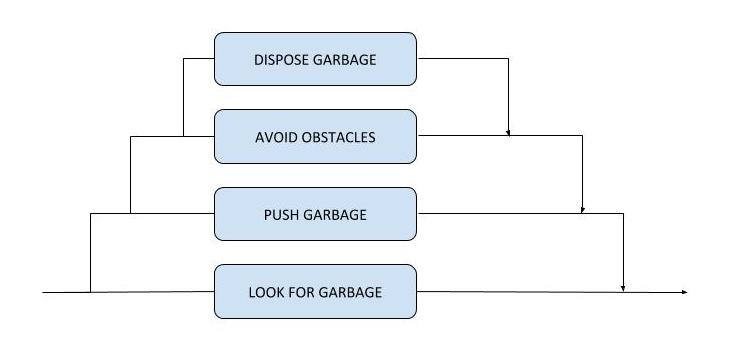

## GARBAGE-COLLECTION ROBOT

#### IMPLEMENTATION

The next robot is programmed to clean the arena of garbage. It searches for "garbage items" in the arena (represented with cans), and pushes it by the wall. The robot continues the process until all garbage has been cleaned. 

To program this behavior, we have started from the controller of the previous robot, modifying the subsumption architecture to fit the new needs. In the end, the subsumption levels were the following:

1. Dispose the garbage, turning around when it is by the wall.
2. Avoid every obstacles.
3. Push the garbage in a straight line, looking for the wall.
4. Look for garbage.

We already explained how subsumption architectures work in the previous robot overview. The most basic level guides the robot in the search for garbage to clean. In case the robot has already found garbage to clean, the upper level subsumes this behaviour, making the robot push the garbage. In this process, we must make sure that the robot does not get stuck with obstacles, so the third level takes control when an obstacle is detected, so the robot can avoid it. The top level just makes the robot turn around when the garbage has already been disposed in the disposal area. 

In this case, the fact that we started from the controller of the previous robot makes the code structure not that evident. The `if-else` statements no longer represent the subsumption architecture. This is also because of the limitations of the robot itself and its sensors. Obstacle detection is carried out using the proximity sensors, but *Webots* documentation estates that the e-puck's proximity sensors are reliable when obstacles are at least 4cm close. This is a huge bottleneck for a few reasons:

* There is no way to detect when the robot is pushing garbage that is already by the wall. Proximity sensors 0 and 7 are useful to know that the garbage is in front of the robot, but sensors 1 and 6 are not capable of detecting the wall behind. This is because the diameter of the cans that represent the garbage is bigger than 4cm.
* This problem extends to the obstacles in the middle of the arena. The robot might push a can against an obstacle and there would not be a way to notice that situation. 

These problems had to be solved, instead of modifying the controller code, modifying the robot's environment, so different sensors could be used. We decided to mark the disposal area and obstacles areas with black color in the ground, the rest being white. This would allow to use the ground sensors to detect obstacles and the disposal area, and the proximity sensors to find and push garbage. 

The code, like with the previous robot, has a main sequence of `if-else` statements that "decide" which behavior should be executed. As said before, in this case this statements do not directly represent the subsumption architecture.

* The first statement is not a part of the architecture, but a way to continue the execution of previous behaviors. When turning around, we used the static variables `turning_around_left` and `turning_around_right` as counters, so the robot could keep on turning the next few iterations of the main loop.
* The next statement checks if the robot has touched a wall, what could be the real wall or an obstacles. Takes a look at the values of the ground sensors and, in case these detect a black area, then the robot starts turning away.
* The next statement runs if the robot is pushing garbage. Uses the proximity sensors 0 and 7 to push it in a straight line, working in a similar way to the robot that followed the black line: moving slightly right or slightly left depending on which of them detects the higher value. 
* The last statement runs only if all the rest did not, which means that there are no obstacles or walls, and the robot is not turning or pushing garbage. In that case, the method `look_for_garbage()` is called. It makes the robot move in a straight line, deviating only if a proximity sensor measures a value bigger than a threshold (80). This does not work perfectly due to the previously mentioned limitations of the proximity sensors, but it has helped find cans faster in some cases. 

As we can see, the "AVOID OBSTACLES" level and the "DISPOSE GARBAGE" level are united in a single statement. It works because the environment demands little differentiation between the disposal area and the obstacles. Both situations, being in the disposal area or in front of an obstacle, require the robot to turn around. That could mean leaving a can in the disposal area, which is considered a success, or in front of an obstacle. The latter could seem like a big problem, but in the testing phase we will see that does not stop the robot from cleaning that can in the end. 

#### TESTING

Again, we are going to test this robot using two different environments. In all of them, OilBarrel objects are going to be placed as obstacles, and the Can objects as garbage. We expect the robot (or robots) to clean the garbage by pushing it to the wall.

* A simple environment, with just garbage and no obstacles. The reason to use this environment is to make sure that the robot is capable of cleaning the arena at a basic level. 
* A complex environment, with some three obstacles and three robots, in addition to the cans. Here, we are going to test how capable the robot is to clean the garbage in a more "accidental" environment resolving crashes against obstacles and other robots.

Other aspects of the simulations are similar to the ones with the previous robot. There will be three "runs" with the complex environment, and two with the simple one, with a duration of 4 minutes and 30 seconds for all of them. The three robots of the complex environment will start from different points, widely separated and moving in different directions. 

Testing with the simple environment, we can observe decent results. In one of the runs, the robot was capable of cleaning all garbage before the time was up. In the other run, there were still three cans to go. 

The inability to guarantee the cleanliness of all garbage does not have anything to do with any problem in the robot's basic behaviours. Once the robots finds a can, it pushes it perfectly and leaves it by the wall, turning away to continue with its duties. Considering that we are using the ground sensors to detect the disposal area, this effectiveness was expected.

However, the robot is not always capable of cleaning all garbage due to the previously mentioned limitations of the proximity sensors. Detecting the cans from a distance is extremely difficult with this e-puck, so the robot needs some luck to pass near one of them. When this happens, the robot is very efficient, but when it does not, it can take some time. 

In the complex environment we noticed some other problems, although in the end the robots have more possibilities of cleaning all the garbage, obviously due to a matter of numbers (three robots clean better than one). We say this because, in the three runs, the robots cleaned all the garbage twice, leaving just one can in the third run. This is positive, but there were other problems worth pointing out. 

First, the limitations when trying to detect obstacles make the robot realize it has to dodge just when the obstacle is in front of it. This, when a can is being pushed, makes the robot leave the can and turn around. Although this behavior is not the ideal, it is compensated because, some time later, another robot comes from a different angle and finds the can. This makes the robot not run into the obstacle, passing him by the side and moving the can successfully. 

The other problem, and probably the biggest one, has to do with the fact that the robots consider each other as garbage. In a similar way to what happened with the first robot, that considered any other robots as obstacles that had to be surrounded, in this case they try to push each other. Having both of them the same "strength", this caused them not to move at all, getting stuck in the same point. Thankfully, this problem was not catastrophic because the robots always ran into each other when moving in different directions, so after two or three seconds, they ended up separating. 

With three robots though, as it happened in the last run, the situation gets worst. Two robots started pushing in approximately the same direction, which made the remaining robot move backwards. In the specific case of the third run, it took them long enough to separate that the robot that was being pushed ended up in the disposal area, far enough from the white floor that the robot was incapable to leave, spinning round itself because it was detecting the black floor in all iterations. This situation was probably the reason why the time was up before all cans where moved to the wall. 

In the end, the limitations of the proximity sensors and the difficulty when trying to differentiate other robots from cans conditioned the final results. However, the wanted behaviors were executed successfully in good enough conditions, which would have been much more difficult without using the ground sensors and a "marked" arena. 

---