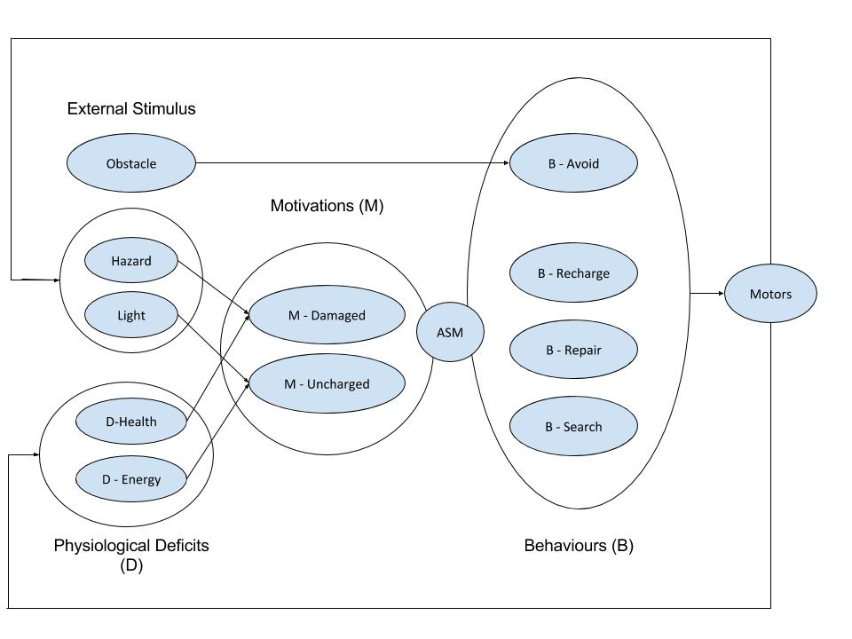
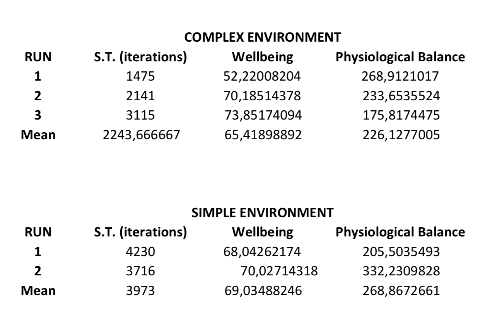

# REPORT

### OVERVIEW

The third and last robot will be a motivated autonomous system that can solve a "two-resource" problem. This robot has a simulated physiology with two homeostatically controlled variables: energy and damage. 

* Energy (or battery) simply decays with time and speed, and when it reaches value zero, the robot dies. For recharging, the robot needs to situate under a light.
* Damage is a result of being too close to obstacles. In our environment, obstacles (and the wall) emit hazardous particles that damage the robot, so the robot should remain as far as possible from these obstacles. When reached 100 damage, the robot is destroyed. For repairing, the robot must situate on a black area of the arena.

This type of motivated architecture has a series of processes that try to maintain the physiological values within a certain range. When the value of this variable (or variables in this case) gets close to a fatal limit, a certain behaviour is triggered (activating function) in order to return that variable to an acceptable value. An organising function combines the individual behavioural components into one coherent behaviour. This is especially important when managing more than one variable, because each variable generally triggers one specific behaviour for adjusting its value.

In the case of our controller, all the decisions made for moving the robot are based on the values that we find in the two fundamental variables. A specific function, `determine_behaviour()`, checks their value and decides which behaviour is going to be executed in each iteration. 

* When there is no need for reparation or recharging, the robot just wanders around. For that, we recycled the `object_avoidance_motor_values()` function described in practical session 7. 
* When there is need for reparation (> 60), the robot is going to look for a black area on the ground, for which we recycled the `line_follow_motor_values()` method from practical 7. An exception to this happens if the energy level decays to a critical state. If the robot runs out of battery, it is going to die either way, but damage can be avoided while trying to recharge.
* When there is need for recharging, the robot is going to follow the light and place under it. 

Obviously, the described behaviour needs of three different sensors of the e-puck. The proximity sensors are responsible for avoiding obstacles and the wall, the light sensors are responsible for detecting the light that lead to the recharging area, and the ground sensors are used for detecting the black boxes on the ground that represent the reparation areas.

For convenience, when the robot finds the recharging area while trying to reach a different goal, we try to take advantage of that by making it stop and recharge. If the robot was just wandering, then there is no urgency and can stop there. If, on the other hand, the robot was looking for a reparation area, remaining stopped in the charging area would not risk receiving more damage (except if another robot impacted with it).

The same thing happens with the reparation areas. When the robot unintentionally finds one, it will stop there for reparations even if it is trying to reach the light for recharging, because no speed means that no energy is lost. 

### TESTING

#### QUALITATIVE TESTING

The tests for this controller are going to be performed, like in the two previous robots, in two different environments and several executions (runs) for each of them.

* The simple environment will have just one robot starting at *(0, 0, 0)* and heading in the direction of the *x-axis*. The number of hazardous obstacles, represented with `OilBarril` objects, is 9, distributed around the starting point of the robot. There will be three corners with reparation areas (black boxes on the ground) and the last corner will have a `PointLight` for recharging the robot. The goal of this test is simply to check the survival capacity of one robot. 
* The complex environment will be exactly like the simple one, but adding two more robots to the equation. One of them will start from *(0.6, 0, -0.3)* and the other from *(0.1, 0, 0.4)*, heading different angles. The goal when running this complex test is to examine the survival capacity of the robots when having to share key areas of the arena. Obviously, the robots will inflict damage to each other when they get too close. 

All runs had a duration of 4 minutes and 30 seconds, as with the previous robots, and the simple environment was used in two runs and the complex one in three runs.

The simple tests showed a more than decent survival capacity for the robot. In an exclusive environment with no other robots, the difficulties for recharging and repairing were almost inexistent. The light is easily detectable and the robot has plenty of time for crossing the entire arena, once the energy alert triggers, before running out of energy. 

When it comes to avoiding damage, most of the interactions are safely detected with time so the robot can change its direction. This was expected, since the method for avoiding obstacles has been used successfully before. However, sometimes the robot gets too close and receives damage, for example when two obstacles are too close and the robot finds itself between them. 

The worst case happens when the robot runs into a corner. That takes it a few iterations to turn enough to escape, so if it got too close in the first place, it will receive a lot of damage and, most certainly, end up being destroyed. This is precisely what occurred in the second run. 

In the first run, however, the robot survived until time finished. This case, in conjunction with many other "unofficial" runs performed during development in which the robot stayed alive all the time, prove that the order of priorities when deciding which behaviour to execute was adequate. 

When it comes to the tests with the complex environment, the results are considerably different. Every robot, on its own, maintains the same level of effectiveness when it comes to surviving that we saw in the simple environment. However, they are sharing the reparation areas and, more importantly, the recharging area. This makes a real difference, because they end up destroying each other until just one of them survives.

The reason why this is happening is pretty simple. Although every robot starts from a different point of the arena, moving in a different direction, and their speeds vary depending on the obstacles they find, they would most likely run into each other when they try to charge. When a robot arrives at the charging area, it has to wait until the energy gets to 100. In that time, another robot would probably arrive and make contact with it. And after that, it happens again with the last robot. This situations always result in at least two robots receiving considerable damage.

In the second run, the three robots were dead at 3 minutes and 10 seconds. All of them happened to need energy almost at the same time, so they inflicted serious damage to each other, destroying one of them. After that, the next time that one robot needed energy, it found a dead robot right by the charging area, close enough to inflict damage so we had a second dead robot. And then, with two robots obstructing the recharging area, the last robot died before being able to escape. In the third run, this happened again with just two robots.

#### QUANTITATIVE TESTING

The following tables show the evolution of the wellbeing of the robot in all the runs performed, both in the simple environment (1 and 2) and in the complex environment (1, 2 and 3).

|  |  | 
| --- | --- |

|  |  |  |
| --- | --- | --- |

This data reflects what we were able to observe during the testing. The simple environment is much more friendly with the robot, allowing it to maintain a decent level of wellbeing. As we can see in the two first charts, the value goes up and down with time: when it goes down, the robot recovers, before it goes done again and so on.

In the *Wellbeing Simple 1* table, we can see that the simulation finished while the robot was recovering. In *Wellbeing Simple 2*, however, the value is descending by the end of the simulation. This is due to the fact that the robot, as we said in the previous section, died when it got to a corner. 

In the charts for the complex tests, it becomes clear that a robot has much more trouble maintaining its level of wellbeing when it has to deal with other robots in the same environment. Only in the third simulation, the graph is much more similar to the ones from the simple tests: it is able to recover every time the wellbeing decays under 50 or so. 

In the other two runs, we see that the wellbeing decays overtime and the robot is never able to recover, except in the second run, where its wellbeing value increases considerably around the middle of its lifetime. This results are due to a significant increase in the `damage` variable overtime: dealing with other robots implies contact most of the time. The energy levels, on the other hand, are very similar to those in the simple environment. 

Now, we are going to have a look at a more general assessment on the results obtained during the testing phase:

These calculations show again the considerably better results obtained with the controller when not having to deal with other robots. To begin with, the Survival Time (S.T.) is about a 50% higher in the simple environment. 

The wellbeing, however, does not seem that much better in the simple environment in the end. In fact, if it was not for the first run, the complex environment would have a better average value. This numbers are very surprising, knowing everything we had observed so far.

Lastly, we have the physiological balance, which is slightly better in the complex environment. This, although it might seem surprising, is very normal. In a run on a simple environment, the need of reparation is very unusual when comparing with a run in the complex environment. The needs of the robot are usually focused on recharging its battery, being the needs of reparation much more uncommon; the fact that some needs are significantly higher than others is reflected in a higher value for the physiological balance.

On a complex environment, on the other hand, running into other robots inflicts damage, which makes the needs of reparation much more frequent. Then, the fact that the physiological balance is better on the complex environment, does not mean that the robot "suffers" less under those circumstances. 

---